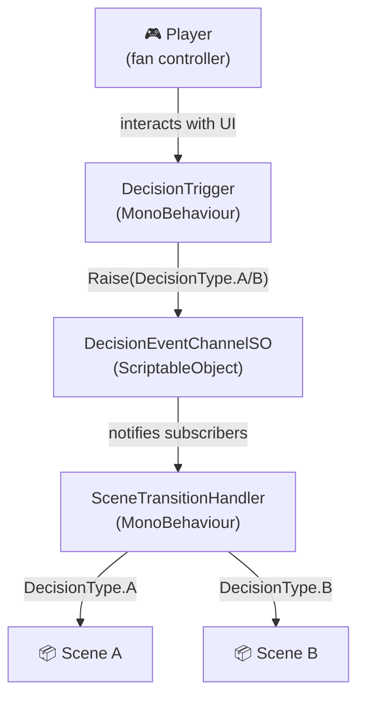
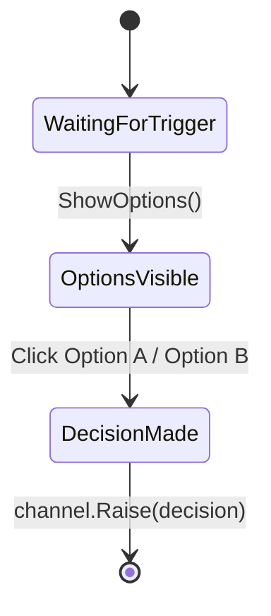
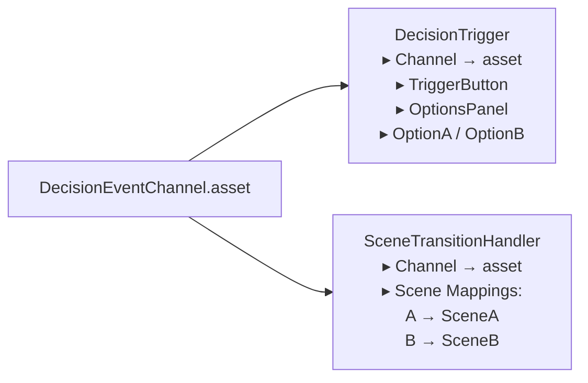

# FAN — Branching Decision System

Juego experimental 3D en Unity 6 (URP) donde el jugador controla un ventilador.
En ciertos momentos del juego se presenta una decisión: el jugador elige entre dos opciones (A o B), y el juego carga la escena correspondiente.

---

## Arquitectura del sistema de eventos

El sistema se basa en el patrón **Observer** con un canal de eventos implementado como **ScriptableObject**. Ninguna clase conoce directamente a otra: todas se comunican a través del canal.



---

## Clases

### `DecisionType` — `Assets/Scripts/Decisions/DecisionType.cs`

Enum que identifica cada decisión posible. Para agregar una nueva decisión basta con añadir un valor aquí.

```csharp
public enum DecisionType { A, B }
```

---

### `DecisionEventChannelSO` — `Assets/Scripts/Events/DecisionEventChannelSO.cs`

El **bus de eventos**. Es un ScriptableObject: existe como asset en el Project y se arrastra a cualquier componente que necesite emitir o escuchar eventos. Esto elimina la dependencia directa entre escenas.

| Método | Quién lo llama |
|---|---|
| `Raise(decision)` | `DecisionTrigger` al detectar una elección |
| `Register(listener)` | `SceneTransitionHandler` en `OnEnable` |
| `Unregister(listener)` | `SceneTransitionHandler` en `OnDisable` |

---

### `DecisionTrigger` — `Assets/Scripts/Decisions/DecisionTrigger.cs`

Controla la UI de decisión en pantalla. **No sabe nada sobre escenas.**

Flujo:
1. Se muestra un botón central ("Show Options")
2. Al presionarlo, aparecen los botones Option A y Option B
3. Al elegir uno, llama a `channel.Raise(decision)`



---

### `SceneTransitionHandler` — `Assets/Scripts/Level/SceneTransitionHandler.cs`

Suscriptor del canal. **No sabe nada sobre la UI ni el trigger.**

- Se suscribe al canal en `OnEnable`, se desuscribe en `OnDisable`
- Mantiene un mapa `DecisionType → SceneName` configurable desde el Inspector
- En el Inspector se arrastra la escena directamente (no se escribe el nombre a mano); `OnValidate` extrae el nombre automáticamente

---

## Setup en el Inspector



El mismo asset `DecisionEventChannel` se asigna a ambos componentes. Es el único punto de contacto entre ellos.

---

## Cómo agregar una nueva decisión

1. Agregar un valor al enum `DecisionType` (ej. `C`)
2. Crear la escena destino en Unity
3. En `SceneTransitionHandler`, agregar un entry en **Scene Mappings**: `Decision: C` → arrastrar la escena
4. Agregar un botón nuevo al `OptionsPanel` y registrarlo en `DecisionTrigger`

**Cero cambios en la lógica de carga de escenas.**

---

## Estructura de archivos

```
Assets/
├── Scenes/
│   ├── SampleScene.unity          ← escena principal
│   ├── TestingA.unity             ← destino decisión A
│   └── TestingB.unity             ← destino decisión B
├── ScriptableObjects/
│   └── Events/
│       └── DecisionEventChannel.asset   ← instancia del canal
└── Scripts/
    ├── Decisions/
    │   ├── DecisionType.cs
    │   └── DecisionTrigger.cs
    ├── Events/
    │   └── DecisionEventChannelSO.cs
    ├── Level/
    │   └── SceneTransitionHandler.cs
    └── Editor/
        └── DecisionUISetup.cs     ← Tools → Fan → Setup Decision UI
```
